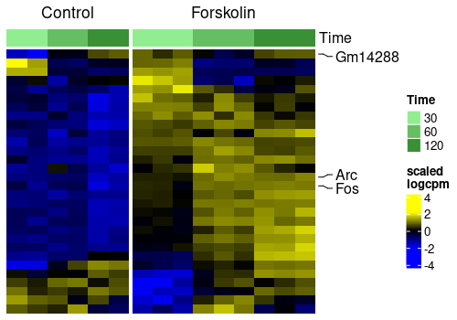

# sechm

**Pierre-Luc Germain, 08.04.2021**

*D-HEST Institute for Neurosciences, ETH Zürich & Laboratory of Statistical Bioinformatics, University Zürich*

***

The *sechm* package is essentially a convenient wrapper around the 
*[ComplexHeatmap](https://jokergoo.github.io/ComplexHeatmap-reference/book/)* 
engine, facilitating the creation of heatmaps from 
*[SummarizedExperiment](https://bioconductor.org/packages/3.10/SummarizedExperiment)*
objects. This was formerly part of the [SEtools](https://github.com/plger/SEtools) package.

Install with:
```r
BiocManager::install("plger/sechm")
```

Example usage:

```r
sechm(SE, genes=myGenes, top_annotation="Time", do.scale=TRUE, gaps_at="Condition",
       mark=c("Gm14288","Fos","Arc"))
```

<!-- -->

See the package's vignette for more information!
